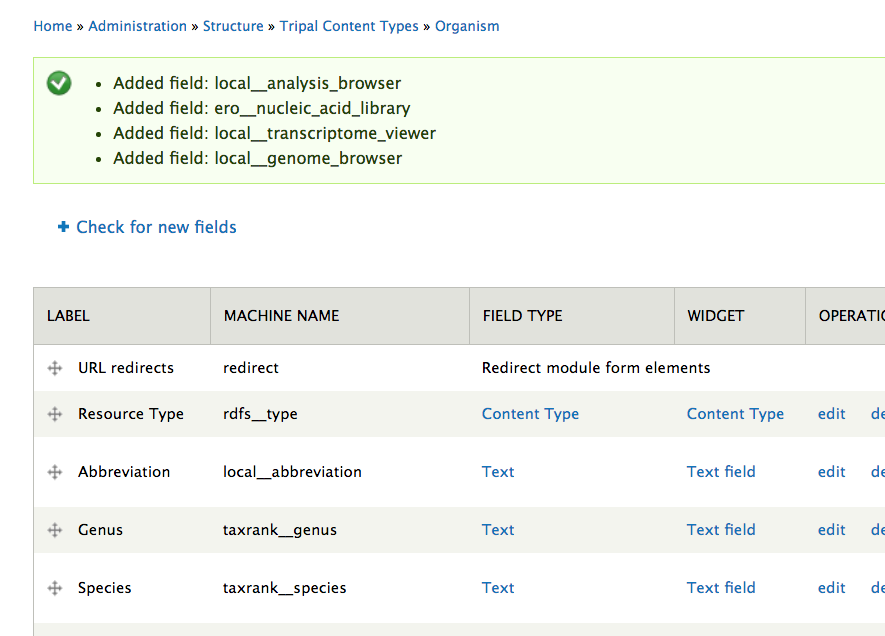
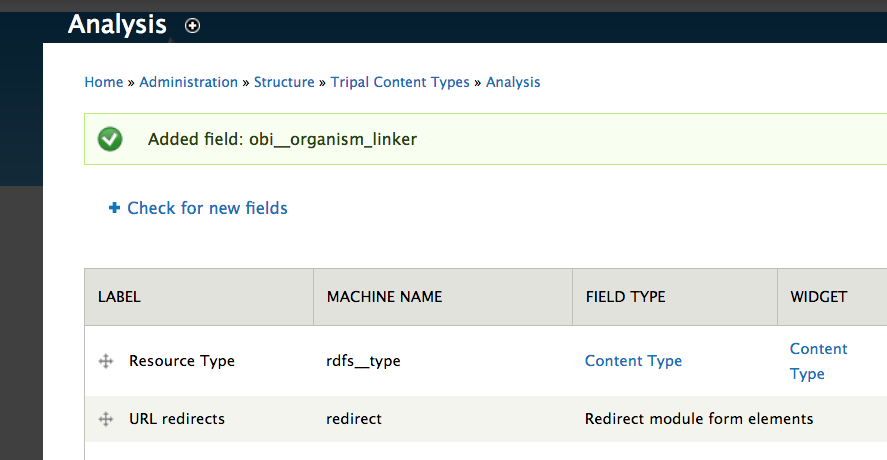
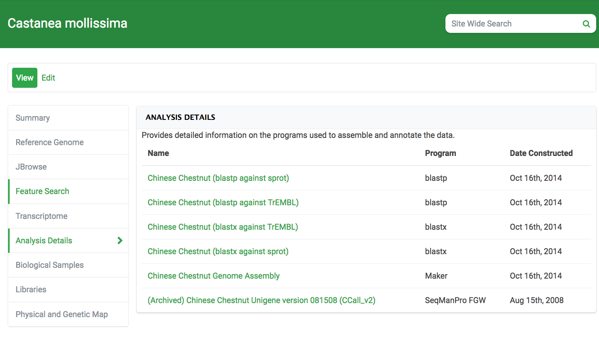

# Tripal Manage Analyses

This module creates browseable analysis and library lists for organisms.

It also provides the `obi__organism` linker.  This linker attaches to **analyses** and lists organisms linked to it.

## Viewer fields

### gene page fields

* data__sequence_features (master field which recursively gathers info for all child features)
* local__child_properties (display properties of child features stores in `featureprop`)
* local__child_annotations (display annotations in child features, stored in `feature_cvterm`)

In Tripal core, gene pages only display info directly related to that underly chado gene feature.  Typically the gene is composed of many child features, which in turn may have annotations in featureprop, feature_cvterm, etc.   These fields gather that information and allow it to be displayed on the gene page.

Please read [this writeup for more information on the gene page fields](/docs/gene_fields.rst).

### analysis viewers

The following fields attach to **organism**.

* local__analysis_browser
* local__genome_browser
* local__transcriptome_viewer
* ero__nucleic_acid_library

These fields are for listing **analysis** entities (or library entities) associated with an organism.  There are unique fields for the transcriptome and genome assembly bundles, so that the user can quickly find these analyses and the corresponding data.

To use the above fields, you also need the field for linking analysis to organism:

## obi__organism linker field

In addition to the viewer fields wich attach to **organism**, we also provide the obi__organism linker field.  This field is the **inverse** of the analysis linker fields.  It attaches to analysis and displays the associated organism.  More importantly, it provides a widget for the analysis, so you can specify the organism so it will show up on the organism page.

# Set Up
## Installation

This module creates a custom table, `organism_analysis`.  It populates this custom table with entries from the `analysis_organism` **mview**, if it exists.  We do this for sites that previously had an `analysis_organism` mview that linked analyses to organisms via their features. However, you may have analyses on your site that do not have features.

We provide a new linker field to populate the `organism_analysis` table: the `obi__organism_linker` field.

### Adding the fields

After enabling the module, you will need to enable the fields you would like to use.

Most fields in this repository are intended to attach to the organism bundle.  Manage the fields for your organism bundle at `admin/structure/bio_data/manage/`.  After pressing the **Check for New Fields** button, you should see the following message:

We also need to enable the `organism_analysis` linker field, `obi__organism_linker`.  This is the field that will let us link an analysis to an organism when we create a new analysis.  Perform the above steps on the `analysis` bundle(s).  You may have multiple analysis bundle types: enable the field on each.

### Enabling the fields

Next, you need to enable the fields.  Press the **Manage Display** tab in the upper right.  Your new fields should now be listed at the bottom, disabled.  Typically you will want to create a new Tripal Group, and enable the desired fields inside of it.

  

You must also enable the organism linker field on your analysis bundles.

### The transcriptome and genome fields

These fields are looking for bundles that are analyses associated with a specific cvterm.  For genome assembly that is operation:0525, and operation:3258 for transcriptome.  If you don't have bundles with those terms, the fields will not work.

### The child feature fields

These fields only attach to entities in mapping to the **feature** table whose type matches the sequence ontology term for **gene**.

# Usage

The display fields provide no widgets: once they are enabled, they will display entities only.

The organism linker field will insert organism - analysis entry links when attached to analysis bundles.

If you previously used the `analysis_organism` mview, then your entries were added to the `organism_analysis` linker table when the module was installed.  If not, you'll need to use the linker field (or SQL) to link your analyses with organisms so they appear in the browser fields.

Your analysis will now appear in the `local__analysis_browser` field for that organism.  You can use this field combined with the `local__genome_browser` and `local__transcriptome_viewer` fields to list all analyses associated with an organism, while emphasizing the reference assembly analyses.  HardwoodGenomics uses this strategy to make assembly and annotation download links easier to find.

### Splitting Analyses

The genome and transcriptome browsers expect a specific bundle for each analysis type.  The Tripal 3 base migrator will create all previous sub-analysis nodes to plain analysis entities. Splitting of analyses is now easily handled via [Tripal Alchemist](https://github.com/statonlab/tripal_alchemist/).
