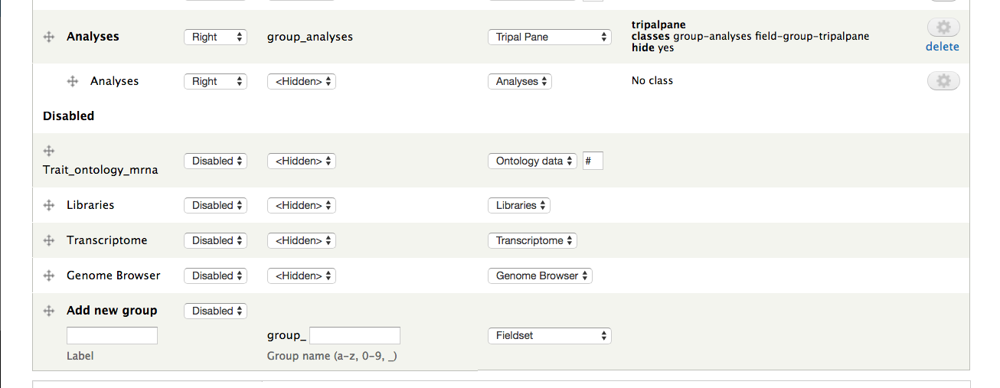
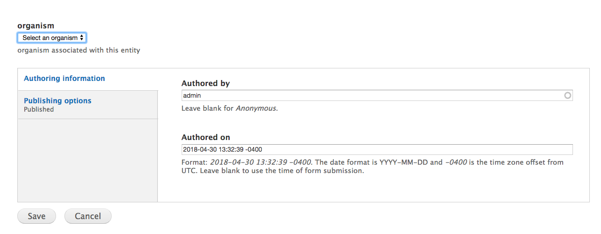

# Tripal Manage Analyses

This module is for implementation of custom fields etc for the Staton lab HWG.

This module creates a custom table, `organism_analysis`.  It populates this custom table with entries from the `analysis_organism` **mview**, if it exists.  We do this for sites that previously had an `analysis_organism` mview that linked analyses to organisms via their features. However, you may have analyses on your site that do not have features.

We provide a new linker field to populate the `organism_analysis` table: the `obi__organism_linker` field.

## Viewer fields

### analysis viewers
* local__analysis_browser
* local__genome_browser
* local__transcriptome_viewer

These fields are for listing **analysis** entities associated with an organism.  Because HWG uses different bundles for different analysis types, we have unique fields for the bundles we want to showcase: transcriptome or genome assemblies.

To use the above fields, you also need the field for linking analysis to organism:

* ero__nucleic_acid_library

### Other
* ero__nucleic_acid_library

This field is for listing **library** entities associated with an organism.

# Set Up

### Adding the fields

After enabling the module, you will need to enable the fields you would like to use.

Most fields in this repository are intended to attach to the organism bundle.  Manage the fields for your organism bundle at `admin/structure/bio_data/manage/`.  After pressing the **Check for New Fields** button, you should see the following message:

We also need to enable the `organism_analysis` linker field, `obi__organism_linker`.  This is the field that will let us link an analysis to an organism when we create a new analysis.  Perform the above steps on the `analysis` bundle(s).  On HWG, we enable this field on all analysis bundle types we create: Transcriptome Assembly, Genome Assembly, Annotation Analysis, etc.

### Enabling the fields

Next, you need to enable the fields.  Press the **Manage Display** tab in the upper right.  Your new fields should now be listed at the bottom, disabled.  Typically you will want to create a new Tripal Group, and enable the desired fields inside of it.

  

You must also enable the organism linker field on your analysis bundles.

### The transcriptome and genome fields

These fields are looking for bundles that are analyses associated with a specific cvterm.  For genome assembly that is operation:0525, and operation:3258 for transcriptome.  If you don't have bundles with those terms, the fields will not work.

# Usage

The display fields provide no widgets: once they are enabled, they will display entities only.

The organism linker field will insert organism - analysis entry links when attached to analysis bundles.

If you previously used the `analysis_organism` mview, then your entries were added to the `organism_analysis` linker table when the module was installed.  If not, you'll need to use the linker field (or SQL) to link your analyses with organisms so they appear in the browser fields.

Your analysis will now appear in the `local__analysis_browser` field for that organism.  You can use this field combined with the `local__genome_browser` and `local__transcriptome_viewer` fields to list all analyses associated with an organism, while emphasizing the reference assembly analyses.  HardwoodGenomics uses this strategy to make assembly and annotation download links easier to find.

### Splitting Analyses

The genome and transcriptome browsers expect a specific bundle for each analysis type.  The Tripal 3 base migrator will create all previous sub-analysis nodes to plain analysis entities. Splitting of analyses is now easily handled via [Tripal Alchemist](https://github.com/statonlab/tripal_alchemist/).
